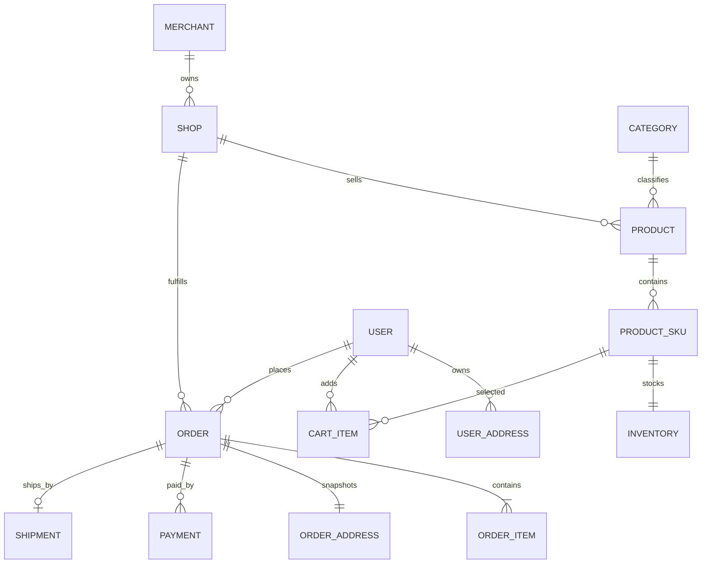
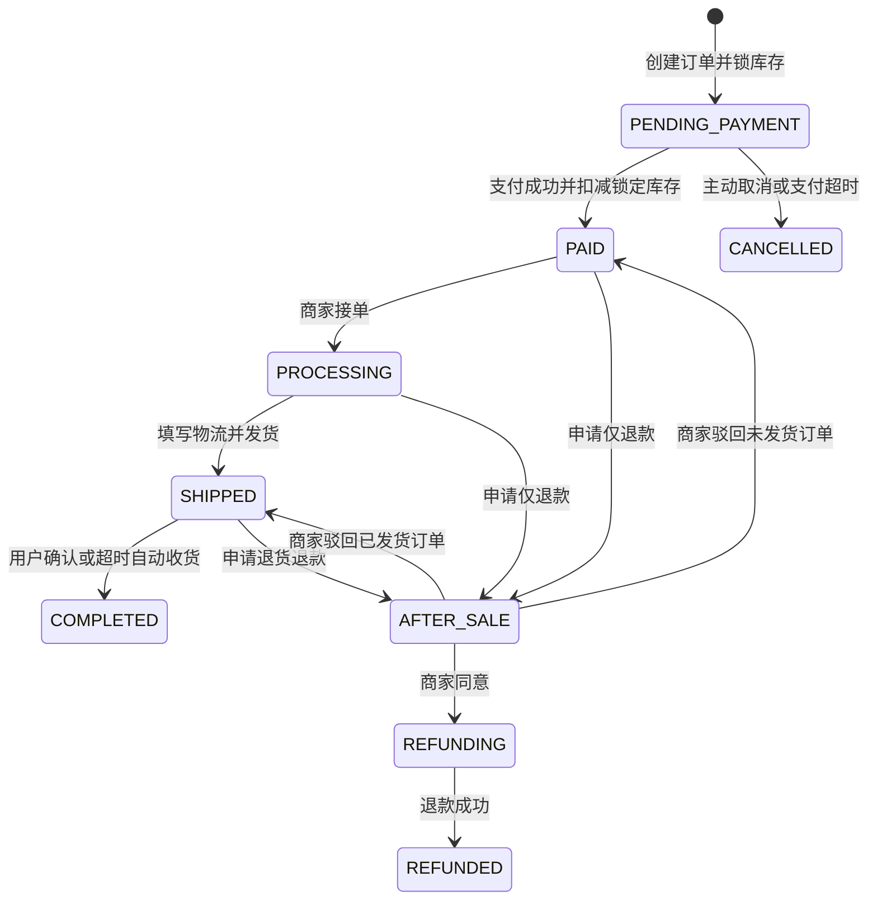

# 架构与接口约定

## 架构原则

首版采用模块化单体。HTTP 请求依次经过路由、控制器、服务和数据访问层：

```text
Router -> Controller -> Service -> Prisma/MySQL
                         |-> Redis/BullMQ
```

- Router 只负责路径、中间件和控制器绑定
- Controller 负责解析 HTTP 输入并输出统一响应
- Service 负责业务规则、权限边界和数据库事务
- Prisma 负责数据访问，禁止在 Router 中直接查询数据库
- 支付、库存和订单状态变化必须记录可审计日志

## 核心实体关系



单商户阶段也创建一条默认 `Merchant` 和 `Shop` 记录。商品和订单始终归属于店铺，后续升级多商户时不需要给核心表补归属字段。

## 订单状态机



状态不可由客户端直接指定，只能通过取消、支付、接单、发货、收货和售后等业务动作转换。

## 金额与库存

- 所有金额以最小货币单位整数存储，人民币单位为分
- 订单和订单项分别保存原价、优惠、运费、应付和实付金额
- 下单时锁定库存：`available - quantity`、`locked + quantity`
- 支付成功后扣减锁定库存：`locked - quantity`
- 取消或超时关闭时释放：`available + quantity`、`locked - quantity`
- 使用数据库事务、条件更新和库存版本号防止超卖
- 每次库存变化写入 `InventoryLog`，并关联订单或售后单

## API 命名

- API 前缀统一为 `/api/v1`
- 资源使用复数名词，例如 `/products`、`/orders`
- 接口只使用 `GET` 和 `POST`：只读查询使用 `GET`，所有写操作使用 `POST`
- 接口路径不使用动态参数；`GET` 参数放在 query，`POST` 参数放在 JSON body
- 写操作通过固定动作路径表达意图，例如 `POST /admin/products/update` 和 `POST /orders/cancel`
- 分页参数使用 `page` 和 `pageSize`，默认按创建时间倒序
- 时间使用 ISO 8601 UTC 字符串，金额使用整数
- 用户端和管理端分别使用 `/api/v1/*` 与 `/api/v1/admin/*`

## 错误与幂等

响应固定包含 `code`、`message`、`data` 和 `requestId`。业务错误使用稳定的英文大写错误码，日志通过 `requestId` 关联。

创建订单、支付请求、支付回调、退款和异步任务必须支持幂等。客户端发起的关键写操作后续统一支持 `Idempotency-Key`，第三方回调使用渠道流水号和数据库唯一索引去重。
